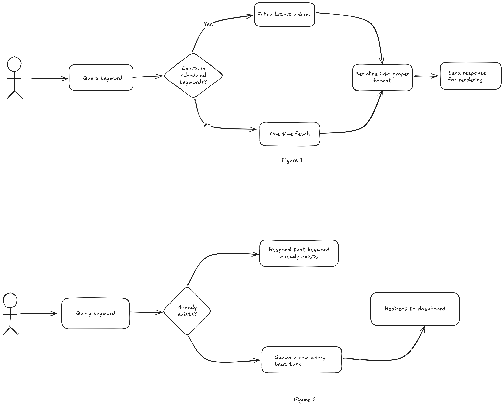

# Backend Assignment (Intern) | FamPay

This project implements a YouTube video fetching system that asynchronously collects and stores video data based on search queries. It provides a RESTful API to retrieve the stored videos in a paginated format, sorted by publishing date.

This allows for the system to be scalable and always serve hot data about new youtube videos.

Additionally there is functionality for interface to interact with the system.

## Features

- Asynchronous YouTube API integration using Celery for background processing
- Multiple YouTube API key support with automatic fallback mechanism
- Paginated API endpoints for retrieving video data
- Database indexing optimizations for faster queries
- Interactive dashboard for viewing video data with sorting and filtering options
- Error handling and logging for API quota management
- Scalable architecture using Django, Redis, and Celery

## Tech Stack
- Python
- Django
- Django REST Framework
- SQLite
- Redis
- Celery
- Celery Beat

## API Endpoints

1. **Interfaces**:
   - **GET** `/`: Web interface to view videos as well as search and add new keywords

2. **API**:
   - **GET** `/api/keyword/<keyword>/videos/`: Retrieve paginated video data
     - Query Parameters:
       - `page`: Page number (default: 1)
       - `page_size`: Number of videos per page (default: 10)
       - Example response: 
       
       ```
       {
            "count": 141,
            "next": "http://localhost:8000/api/videos/?page=2",
            "previous": null,
            "results": [
                {
                    "video_id": "",
                    "title": "",
                    "description": "",
                    "published_at": "",
                    "channel_title": "",
                    "thumbnail": "",
                    "created_at": "",
                    "updated_at": "",
                    "keyword": 18,
                    "keyword_text": "some_keyword",
                    "method": "invidious"
                },
                {
                    "video_id": "",
                    "title": "",
                    "description": "",
                    "published_at": "",
                    "channel_title": "",
                    "thumbnail": "",
                    "created_at": "",
                    "updated_at": "",
                    "keyword": 18,
                    "keyword_text": "some_keyword",
                    "method": "youtube"
                }, 
                ... 10 more items per page
            ]
        }

       ```
          
   - **GET** `/api/videos/{video_id}/`: Retrieve a specific video by ID

## Installation and Setup
- Rename example.env to .env

### Using containers
<details>

1. **Install docker and docker-compose as per your platform:** [Docs](https://docs.docker.com/get-started/get-docker/)

2. **Verify docker is installed using:**
   ```bash
   docker --version
   ```
3. **Run project using docker-compose**:  
   ```bash 
   docker-compose up --build
   ```
</details>

---
### Natively
<details>

- In .env rename REDIS_HOST's value to localhost
- Please ensure that a local redis instance is present for manual installation
1. **Clone the Repository**:
   ```bash
   https://github.com/omkargwagholikar/FamPay_Backend_Task.git
   cd FamPay_Backend_Task
   ```
2. **Install Dependencies**:
   ```bash
   pip install -r requirements.txt
   ```

3. **Run Migrations**:
   ```bash
   python manage.py makemigrations
   python manage.py migrate
   ```

4. **Run Celery Worker and Beat**:
   ```bash
   celery -A config worker -l info
   ```
   ```bash
   celery -A config beat -l INFO
   ```

5. **Run Django Server**:
   ```bash
   python manage.py runserver
   ```
</details>

---

## Stateflow and Usage


*Stateflow diagram*


The system follows a continuous cycle of operations:
1. Celery Beat schedules periodic tasks to fetch YouTube videos
2. Worker processes fetch videos using the YouTube API
3. New videos are stored in the database with proper indexing
4. API serves video data from the database in paginated responses
5. Dashboard provides visualization of stored videos


API Key Management Flow:
1. System starts with primary API key
2. When quota is exhausted, system automatically switches to next available key
3. If all keys are exhausted, system logs the error and pauses fetching until reset
4. Admin is notified of quota exhaustion

---

## Folder Structure
```
FamPay_Backend_Task/
├── apps/
│   ├── dashboard/
│   │   └── templates
│   └── videos/
│       ├── models.py
│       ├── views.py
│       ├── serializers.py
│       └── tasks.py
├── config/
│   ├── settings.py
│   └── celery.py
├── core/
│   └── youtube_api.py
├── media/
├── .env
├── docker-compose.yml
├── Dockerfile
├── manage.py
└── requirements.txt
```
- **`apps/videos`**: Contains all video-related functionality including models, views, serializers, and tasks
- **`apps/dashboard`**: Contains the web interface for viewing videos and statistics
- **`config`**: Contains project configuration including settings and Celery setup
- **`core`**: Contains core functionality like the YouTube API client
- **`celery.py`**: Contains the configuration for Celery
- **`tasks.py`**: Contains Celery tasks for fetching videos from YouTube
- **`models.py`**: Defines the core models for videos and API keys

---

## Models Overview

### KeyWordEntry

Stores search keywords for video fetching operations.

- `keyword`: Text field containing the search term (unique)
- `created_at`: Timestamp of when the keyword was added

When a keyword is deleted, any associated periodic tasks are also automatically removed.

### Video

Stores metadata for videos fetched from YouTube.

- `video_id`: YouTube's unique video identifier (primary key)
- `title`: Video title
- `description`: Video description
- `published_at`: When the video was published (indexed for performance)
- `channel_title`: Name of the YouTube channel
- `thumbnail`: URL to the video thumbnail
- `created_at`: When the record was created
- `updated_at`: When the record was last updated
- `keyword`: Foreign key to the KeyWordEntry that triggered this video's fetch
- `method`: Source API used to fetch the video (YouTube or Invidious)

### VideoLog

Tracks the results of video fetch operations.

- `error`: Boolean indicating if the fetch operation encountered errors
- `method`: API used for fetching (YouTube or Invidious)
- `number_added`: Count of videos added in this operation
- `created_at`: Timestamp of the operation
- `keyword`: Foreign key to the KeyWordEntry used for this fetch
---

## Video Fetch Methods

Two methods are supported for fetching videos:

- `YOUTUBE`: Uses the official YouTube API
- `INVIDIOUS`: Uses the Invidious API as an alternative/fallback

## Celery Tasks

The `process_trigger` function handles:

1. Taking a keyword and searching for related videos
2. Attempting to fetch videos using the configured API
3. Processing the response based on the API format
4. Storing video metadata in the database
5. Creating a log entry for the fetch operation

Videos are stored with `update_or_create` to avoid duplicates, updating existing entries when videos are fetched again.


---

## Cost Analysis

The YouTube Data API v3 provides a daily quota of 10,000 units per project. Each search request costs 100 units.

- With the default 10-second interval, we make 8,640 requests per day (1 request every 10 seconds)
- Total cost: 8,640 * 100 = 864,000 units per day

Since this exceeds the free tier quota, the application implements:
1. Multiple API key support (rotational usage)
2. Configurable fetch interval (can be adjusted based on requirements)

For a production environment, it's recommended to:
- Increase the fetch interval to 60 seconds or more
- Register multiple API keys (at least 9 for continuous 24/7 operation)