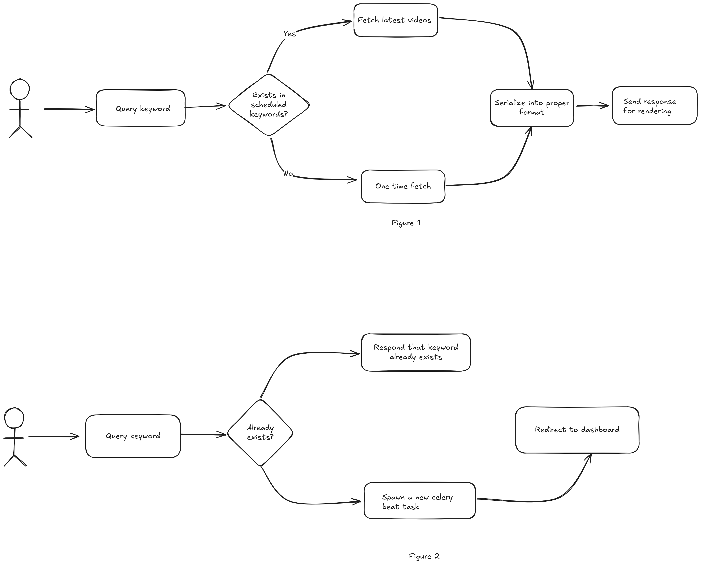

# Backend Assignment (Intern) | FamPay

This project is designed to provide functionality for scheduling, processing, and logging events. It integrates `Django`, `Django Rest Framework (DRF)`, `Redis`, `Celery`, and `Django-Celery-Beat` for task management and asynchronous operations.

This allows for the system to be scalable and always serve hot data about new youtube videos.

Additionally there is functionality for interface to interact with the system.

## Features

---


## API Endpoints

1. **Interfaces**:
   - **GET** ` `: Interface path

2. **API**:

---

## Installation and Setup
- Rename example.env to .env

### Using containers
<details>

1. **Install docker and docker-compose as per your platform:** [Docs](https://docs.docker.com/get-started/get-docker/)

2. **Verify docker is installed using:**
   ```bash
   docker --version
   ```
3. **Run project using docker-compose**:  
   ```bash 
   docker-compose up --build
   ```
</details>

---
### Natively
<details>

- In .env rename REDIS_HOST's value to localhost
- Please ensure that a local redis instance is present for manual installation
1. **Clone the Repository**:`
   ```bash
   https://github.com/omkargwagholikar/FamPay_Backend_Task.git
   cd FamPay_Backend_Task
   ```
2. **Install Dependencies**:
   ```bash
   pip install -r requirements.txt
   ```

3. **Run Migrations**:
   ```bash
   python manage.py makemigrations
   python manage.py migrate
   ```

4. **Run Celery Worker and Beat**:
   ```bash
   celery -A config worker -l info
   ```
   ```bash
   celery -A config beat -l INFO
   ```

5. **Run Django Server**:
   ```bash
   python manage.py runserver
   ```
</details>

---

## Stateflow and Usage


*Stateflow diagram*

### Figure 1

### Figure 2
---


## Folder Structure
```
FamPay_Backend_Task/
├── apps/
│   ├── dashboard/
│   │   └── templates
│   └── videos/
│       ├── models
│       ├── views
│       ├── serializers
│       └── tasks
├── config/
│   ├── settings
│   └── celery.py
├── core/
│   └── youtube_api.py
├── media/
├── .env
├── manage.py
└── requirements.txt
```
- **`auth_jwt`**: Contains code for JWT token passing as well as the relevant endpoints

- **`celery.py`**: Contains the configuration for the celery

- **`tasks.py`**:  Contains Celery tasks for processing triggers and managing event logs.

- **`models.py`**: Defines the core models for triggers, event logs, and deletion logs.

- **`settings.py`**: Has the configuration details for the entire project

- **`tests.py`**: Has the tests for the API endpoints

---

## Models Overview


---

## Celery Tasks


---

## Cost Analysis

---